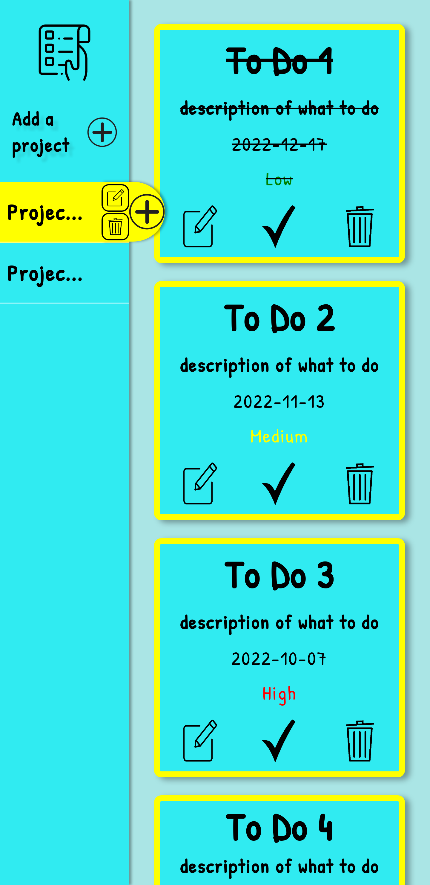

[![Contributors][contributors-shield]][contributors-url]
[![Forks][forks-shield]][forks-url]
[![Stargazers][stars-shield]][stars-url]
[![Issues][issues-shield]][issues-url]
[![MIT License][license-shield]][license-url]
[![LinkedIn][linkedin-shield]][linkedin-url]

<!-- PROJECT LOGO -->
 

  

<h3 align="center">To Do List</h3>

  

    To Do List
     
    <a href="https://github.com/sirjamo1/To-Do-List-Odin"><strong>Explore the docs »</strong></a>
     
     
    <a href="https://github.com/sirjamo1.io/To-Do-List-Odin">View Demo</a>
    ·
    <a href="https://github.com/sirjamo1/To-Do-List-Odin/issues">Report Bug</a>
    ·
    <a href="https://github.com/sirjamo1/To-Do-List-Odin/issues">Request Feature</a>
  

<!-- TABLE OF CONTENTS -->

  
Table of Contents

  <ol>
    <li>
      <a href="#about-the-project">About The Project</a>
      <ul>
        <li><a href="#built-with">Built With</a></li>
      </ul>
    </li>
    <li>
      <a href="#getting-started">Getting Started</a>
    </li>
    <li><a href="#contact">Contact</a></li>
    <li><a href="#acknowledgments">Acknowledgments</a></li>
  </ol>

<!-- ABOUT THE PROJECT -->

## About The Project

To Do List was built for The Odin Project.

-   Create/edit/delete projects.
-   Create/edit/delete to dos within projects.
-   Mark to dos as completed.
-   Save to local storage.
-   Css animations.
-   Fully responsive layout.
-   Uses webPack.
-   Uses Modules.

(<a href="#readme-top">back to top</a>)

### Built With

-   JavaScript
-   webPack

(<a href="#readme-top">back to top</a>)

<!-- GETTING STARTED -->

## Getting Started

Click the icon for live preview
 

(<a href="#readme-top">back to top</a>)

<!-- CONTACT -->

## Contact

James Howells - jam_how@hotmail.com

Project Link: [https://github.com/sirjamo1/To-Do-List-Odin](https://github.com/sirjamo1/To-Do-List-Odin)

(<a href="#readme-top">back to top</a>)

<!-- ACKNOWLEDGMENTS -->

## Acknowledgments

-   Plus button from https://www.vecteezy.com
-   To do logo from https://www.clipartmax.com
-   Trash bin icon from https://www.kindpng.com
-   Edit icon from https://www.icons8.com
-   Font from https://fonts.google.com/specimen/Patrick+Hand#styles

(<a href="#readme-top">back to top</a>)

<!-- MARKDOWN LINKS & IMAGES -->
<!-- https://www.markdownguide.org/basic-syntax/#reference-style-links -->

[contributors-shield]: https://img.shields.io/github/contributors/sirjamo1/To-Do-List-Odin.svg?style=for-the-badge
[contributors-url]: https://github.com/sirjamo1/To-Do-List-Odin/graphs/contributors
[forks-shield]: https://img.shields.io/github/forks/sirjamo1/To-Do-List-Odin.svg?style=for-the-badge
[forks-url]: https://github.com/sirjamo1/To-Do-List-Odin/network/members
[stars-shield]: https://img.shields.io/github/stars/sirjamo1/To-Do-List-Odin.svg?style=for-the-badge
[stars-url]: https://github.com/sirjamo1/To-Do-List-Odin/stargazers
[issues-shield]: https://img.shields.io/github/issues/sirjamo1/To-Do-List-Odin.svg?style=for-the-badge
[issues-url]: https://github.com/sirjamo1/To-Do-List-Odin/issues
[license-shield]: https://img.shields.io/github/license/sirjamo1/To-Do-List-Odin.svg?style=for-the-badge
[license-url]: https://github.com/sirjamo1/To-Do-List-Odin/blob/master/LICENSE.txt
[linkedin-shield]: https://img.shields.io/badge/-LinkedIn-black.svg?style=for-the-badge&logo=linkedin&colorB=555
[linkedin-url]: https://linkedin.com/in/linkedin_username
[product-screenshot]: images/screenshot.png
[next.js]: https://img.shields.io/badge/next.js-000000?style=for-the-badge&logo=nextdotjs&logoColor=white
[next-url]: https://nextjs.org/
[react.js]: https://img.shields.io/badge/React-20232A?style=for-the-badge&logo=react&logoColor=61DAFB
[react-url]: https://reactjs.org/
[vue.js]: https://img.shields.io/badge/Vue.js-35495E?style=for-the-badge&logo=vuedotjs&logoColor=4FC08D
[vue-url]: https://vuejs.org/
[angular.io]: https://img.shields.io/badge/Angular-DD0031?style=for-the-badge&logo=angular&logoColor=white
[angular-url]: https://angular.io/
[svelte.dev]: https://img.shields.io/badge/Svelte-4A4A55?style=for-the-badge&logo=svelte&logoColor=FF3E00
[svelte-url]: https://svelte.dev/
[laravel.com]: https://img.shields.io/badge/Laravel-FF2D20?style=for-the-badge&logo=laravel&logoColor=white
[laravel-url]: https://laravel.com
[bootstrap.com]: https://img.shields.io/badge/Bootstrap-563D7C?style=for-the-badge&logo=bootstrap&logoColor=white
[bootstrap-url]: https://getbootstrap.com
[jquery.com]: https://img.shields.io/badge/jQuery-0769AD?style=for-the-badge&logo=jquery&logoColor=white
[jquery-url]: https://jquery.com
